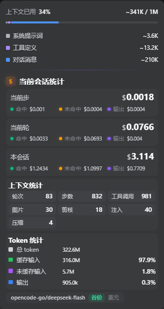
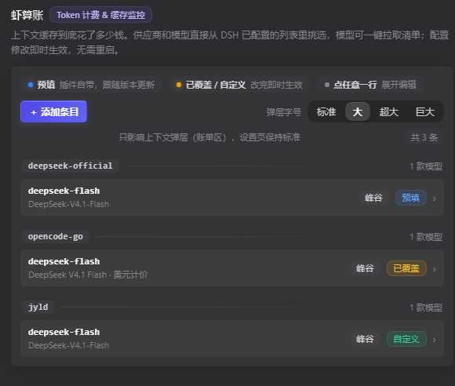

# 虾算账 · dsh-axia-cachebilling

[English](./README.en.md)

> **Token 计费 & 缓存监控** —— 挂在 DSH 上下文弹层里的实时账单。

DSH 里聊得越久，上下文越长，钱就越花在**缓存**上：一算下来，账单里 90% 以上可能都是缓存读取。
虾算账把这件事实时摊开给你看 —— 每次请求、每一轮、整个会话，命中多少、未命中多少、输出多少，各花了多少钱；再配上按会话事件真实统计的上下文指标。

## 它是什么

一个 DSH Web 插件（宿主半身 + 浏览器半身），把自己贴进 **DSH 自带的上下文占用弹层**里，不新开页面、不挡聊天。

### 弹层里看到什么

| 区块 | 内容 |
|---|---|
| **当前会话统计** | 三档账单：**当前步 / 当前轮 / 本会话**，每档给出合计与 **命中 / 未命中 / 输出** 三笔明细；底部一行模型胶囊（`provider/model · 谷价/峰价 · 货币`）|
| **上下文统计** | 8 项**按会话日志事件真实计数**的指标：轮次、步数、工具调用、图片、剪枝、注入、压缩（+ 预估费用）；不是估算、不是占比推算 |
| **Token 统计** | **总 token** 一行 + 缓存输入 / 未缓存输入 / 输出三行，给百分比与绝对量 |




金额口径：

- **多币种自动统一**：按实时汇率把「元」与「美元」折算成**当前条目计费币种**单一展示（汇率取自 `open.er-api.com`，带本地缓存与失败回退；取不到就退化为并列展示，绝不瞎算）；
- **峰谷价**：支持按峰谷时段分别计价；
- 第三方中转同样计费，按价目表匹配模型。

### 设置页能做什么




- 供应商 / 模型从 **DSH 已配置的列表**里挑，可一键拉取模型清单；
- **价目目录**：内置 Open Code / Command Code / GLM / Kimi / MiniMax / MiMo 等模型价格，新增条目或改动模型时自动填价，也可手动「刷新价格」；
- 自定义条目（一口价 / 峰谷价、元或美元），改完**即时生效，无需重启**；
- 弹层字号档位（标准 / 大 / 超大 / 巨大）——只作用于弹层，设置页保持标准大小。

## 安装

```bash
dsh plugin --profile web add github:Animal2404/dsh-axia-cachebilling
```

装完重启 DSH，打开任意会话的**上下文占用弹层**即可看到账单。

## 给维护者

- **构建只在 GitHub Actions 进行**：`.github/workflows/build.yml` 在 `main` 的 push 上执行 `npm install` + `npm run build`（esbuild），把产物 `lib/` 回写进仓库并上传为 artifact；本地只需 `git pull` 拿产物，不需要本地构建。
- 源码：`src/index.ts`（宿主投影：按会话事件流计价与计数）、`src/client.ts`（弹层 UI）、`src/settings.ts`（设置页 UI）、`src/prices.ts`（价目目录拉取与匹配）；
- 价目目录：仓库根 `price-catalog.json`，客户端按需拉取并缓存。

## 致谢与出处

本插件基于同生态下的 MIT 项目演进而来，特此注明：

- 最初的 `dsh-cache-billing`（作者 **Phant0Meow**）：三档账单的原始思路与实现基础；
- **better-er** 的大幅重写：三级账单、第三方中转支持、缓存失效统计等。

按 MIT 许可要求，上游版权声明保留在 [`LICENSE`](./LICENSE) 中。

## 许可

MIT —— 见 [`LICENSE`](./LICENSE)。
